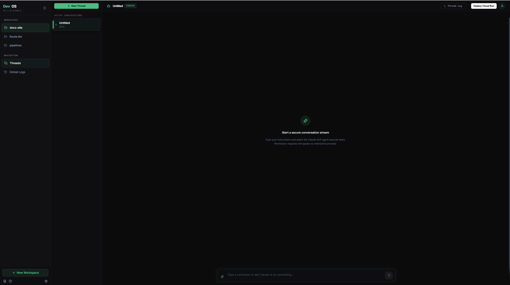

# DevOS – AI-Powered Agent Development Environment

<div align="center">
  
</div>

A modern, open-source development environment for building and iterating with AI agents. DevOS provides a clean HTTP API wrapper around the [Agent Client Protocol (ACP)](https://modelcontextprotocol.io/) for seamless multi-threaded conversations with Claude.

## Features

- **Multi-workspace support** – Organize projects and threads by workspace
- **Raw ACP message storage** – Capture every interaction for reproducibility and debugging
- **Automatic permission handling** – Fine-grained tool approval with pattern-based auto-approval
- **Real-time status tracking** – Monitor agent state across `idle`, `thinking`, and `awaiting_permission`
- **Built-in REST API** – Full control via HTTP for integration with your own tools

## Database

**SQLite** (auto-created as `devos.db`)

From JSON? Run: `npx tsx scripts/migrate-db.ts`

See **[docs/SQLITE_REFERENCE.md](./docs/SQLITE_REFERENCE.md)** for schema, testing, and troubleshooting.

## Architecture

DevOS is built on a **thin HTTP router** philosophy:

- **`src/`** – React UI for chat interface and workspace management
- **`server_src/`** – Express server, ACP protocol wrapper, and database layer
- **`db.json`** – Raw ACP message storage (source of truth for conversation state)

For detailed architecture docs, see [`docs/ACP_ARCHITECTURE.md`](./docs/ACP_ARCHITECTURE.md).

## Quick Start

### Prerequisites

- **Node.js** 18+
- **Claude API key** (Anthropic)

### Installation

1. Clone the repository:
   ```bash
   git clone <repo-url>
   cd devos
   ```

2. Install dependencies:
   ```bash
   npm install
   ```

3. Configure environment:
   ```bash
   cp .env.example .env
   ```
   Set `GEMINI_API_KEY` or `ANTHROPIC_API_KEY` in `.env`

### Run Locally

```bash
npm run dev
```

The app will start on `http://localhost:3000` with Vite hot-reload.

### Build for Production

```bash
npm run build
npm run start
```

## API Overview

### Workspaces
- `GET /api/workspaces` – List all workspaces
- `POST /api/workspaces` – Create a new workspace
- `PATCH /api/workspaces/:workspaceId` – Update workspace name
- `DELETE /api/workspaces/:workspaceId` – Delete workspace

### Threads
- `GET /api/workspaces/:workspaceId/threads` – List threads in workspace
- `POST /api/workspaces/:workspaceId/threads` – Create new thread
- `GET /api/threads/:threadId` – Get thread details
- `PATCH /api/threads/:threadId` – Update thread
- `DELETE /api/threads/:threadId` – Delete thread

### Messages
- `GET /api/threads/:threadId/messages` – Get conversation history
- `POST /api/threads/:threadId/messages` – Send a prompt to the agent

### Permissions
- `GET /api/allowedPatterns` – View auto-approval patterns
- `POST /api/allowedPatterns` – Add a tool command pattern
- `DELETE /api/allowedPatterns` – Remove a pattern
- `POST /api/threads/:threadId/respond` – Respond to permission request

## Development

### Scripts

```bash
npm run dev          # Start dev server with Vite hot-reload
npm run build        # Production build (Vite + esbuild)
npm run lint         # Type-check with TypeScript
npm test             # Run test suite
npm test:watch       # Run tests in watch mode
```

### Project Structure

```
devos/
├── server_src/
│   ├── server.ts              # Express router
│   ├── db.sqlite.ts           # SQLite layer
│   ├── claudeAgent.ts         # ACP wrapper
│   └── *.test.ts              # Tests (72 total)
├── src/
│   ├── components/            # React UI
│   ├── types.ts              # Shared types
│   └── App.tsx               # Main app
├── docs/
│   ├── ACP_ARCHITECTURE.md
│   ├── SQLITE_REFERENCE.md
│   ├── QUICK_REFERENCE.md
│   └── UI_RENDERING_GUIDE.md
├── scripts/
│   └── migrate-db.ts         # JSON→SQLite
├── devos.db                  # Database (auto-created)
└── package.json
```

## Testing

```bash
npm run test              # All tests (72 passing)
npm run test:watch       # Watch mode
npm run test -- server_src  # Server + DB tests
```

Tests include database layer, API endpoints, and cascade deletion scenarios.

## Documentation

- **[ACP Architecture](./docs/ACP_ARCHITECTURE.md)** – How the agent protocol works
- **[Architecture Diagrams](./docs/ARCHITECTURE_DIAGRAMS.md)** – System and data flow
- **[UI Rendering Guide](./docs/UI_RENDERING_GUIDE.md)** – How ACP messages are rendered
- **[Quick Reference](./docs/QUICK_REFERENCE.md)** – API and debugging reference

## Key Concepts

### Permission Flow

When an agent tries to execute a tool:

1. ACP subprocess sends `session/request_permission` message
2. Server checks against stored patterns for auto-approval
3. If pattern matches → auto-approve and resume
4. If no match → UI renders permission prompt, awaits user
5. User clicks option → server forwards response to ACP

### Thread Lifecycle

```
idle → thinking → awaiting_permission → thinking → idle
 ↑                                                      ↓
 └──────────────────────────────────────────────────────┘
```

### Message Types in Database

- `"user_message"` – User prompt
- `"session/update"` – Agent progress (e.g., tool calls)
- `"session/request_permission"` – Tool needs approval
- `"permission_response"` – User's approval/denial
- `"error"` – Errors during execution
- `"permission_response"` (auto-approved) – Pattern matched

## Contributing

We welcome contributions! Please:

1. Fork the repository
2. Create a feature branch (`git checkout -b feature/my-feature`)
3. Commit changes (`git commit -m 'Add feature'`)
4. Push to your fork (`git push origin feature/my-feature`)
5. Open a Pull Request

## License

MIT – See [LICENSE](./LICENSE) for details.

## Support

- **Issues & bugs**: [GitHub Issues](https://github.com/yourusername/devos/issues)
- **Discussions**: [GitHub Discussions](https://github.com/yourusername/devos/discussions)
- **Documentation**: [docs/](./docs/)

---

Built with ❤️ using [React](https://react.dev), [Express](https://expressjs.com/), and the [Agent Client Protocol](https://modelcontextprotocol.io/).
